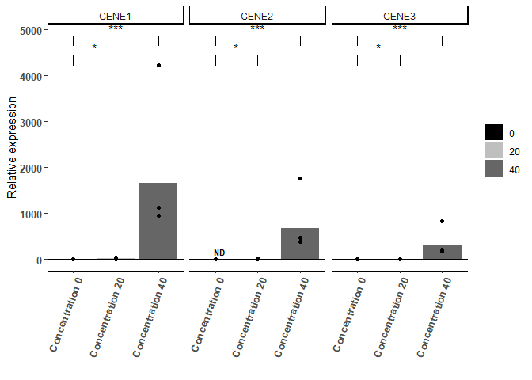
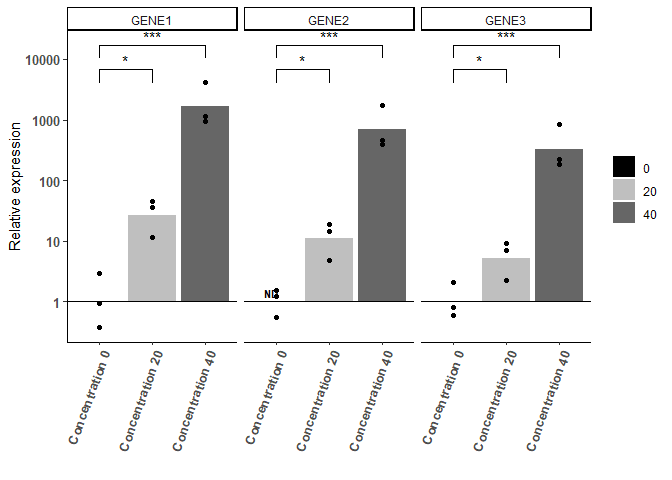

RtqpcR: Analysis of RT-qPCR expression data.
============================================

This package facilitates the analysis of RT-qPCR expression data
(reverse transcriptase quantitative polymerase chain reaction). Here
below we provide a tutorial for a standard qPCR analysis.

Dependencies
------------

Before starting any qPCR analysis, please install the following
packages:

    BiocManager::install("readxl")
    BiocManager::install("dplyr")
    BiocManager::install("ggplot2")

Installation
------------

Install the RTqpcR package by running:

    devtools::install_github("jonathandesmedt92/RtqpcR")
    library(RtqpcR)

Tutorial
========

Reading the raw expression data.
--------------------------------

To date, RtqpcR is only compatible with qPCR data from a Viaa7 platform
(384-well plates). The first step is to read in the expression data. At
this point, the user has to decide how to deal with undetected mRNA
expression values. We generally recommend setting these expression
values to 40 (i.e. maximal CT value). These values will be plotted in
graphs, however they will not be included in statistical analyses.

    # Initialise an RtqpcR object
    obj<-qpcr()

    # Read in the expression data
    obj<-read_qpcr(qpcr = obj, files = "data/test.xlsx")

Adding a sample annotation
--------------------------

We recommend to always write a sample annotation file. This allows one
to… - keep track of all experimental data in the long run, - have a
detailed and full experimental description for each sample, - easily
include and use experimental variables in plots, - use a minimal
labelling (i.e. numbering) in each step of the wet lab part of qPCR.

The sample annotation file should have at least columnn (named
‘Sample’). Each biological replicate should have a different sample
identifier. Technical replicates will have the same identifier and their
expression values will be aggregated accordingly.

As as example for this tutorial, our annotation file looks like this:

    ##   Sample Concentration Bio_rep
    ## 1      1             0       1
    ## 2      2             0       2
    ## 3      3             0       3
    ## 4      4            20       1
    ## 5      5            20       2
    ## 6      6            20       3

    # Read in the sample annotation
    obj<-add_annot(qpcr = obj, file = "data/annotation.xlsx")

Performing the core qPCR analysis
---------------------------------

In this step the main analysis will be done. This includes aggregating
values of the technical replicates, aggregating values of the reference
genes, and calculating delta CT values.

    obj<-analyse_qpcr(qpcr = obj, reference_genes = c("GENE4","GENE5","GENE6"), aggregation ="geomean")

Creating plots
--------------

Several plotting functions are available to make bar charts and line
graphs.

    # We create a barplot with linear or logarithmic scale
    bar_plot(qpcr=obj, 
            xvar="Concentration", 
            baseline_samples=c(1,2,3), 
            genes=c("GENE1","GENE2","GENE3"), 
            ND_y_nudge=0.5, 
            comparisons = list(c("0","20"),
                               c("0","40")),
            xlabels = c("0" = "Concentration 0", "20" = "Concentration 20","40" = "Concentration 40"),
            linear = T,
            y_breaks = NULL,
            map_signif_level = T,
            legend = T,
            step_increase=0.1,
            tip_length=0.05,
            bar_fill = "Concentration",
            colors = c("#000000","#bfbfbf","#666666"))

    bar_plot(qpcr=obj, 
            xvar="Concentration", 
            baseline_samples=c(1,2,3), 
            genes=c("GENE1","GENE2","GENE3"), 
            ND_y_nudge=0.5, 
            comparisons = list(c("0","20"),
                               c("0","40")),
            xlabels = c("0" = "Concentration 0", "20" = "Concentration 20","40" = "Concentration 40"),
            linear = F,
            y_breaks = c(1,10,100,1000,10000),
            map_signif_level = T,
            legend = T,
            step_increase=0.1,
            tip_length=0.05,
            bar_fill = "Concentration",
            colors = c("#000000","#bfbfbf","#666666"))

